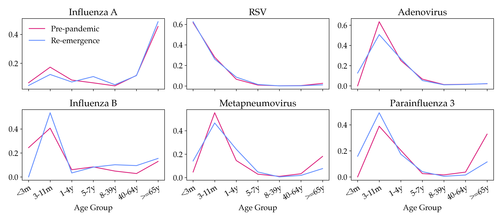
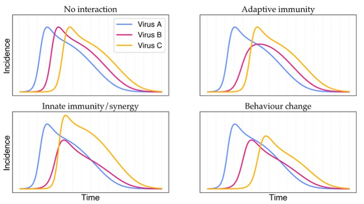

I'm Ben, a postdoctoral researcher in [Joe Lewnard's research group](https://joelewnard.github.io/joelewnard/) in the School of Public Health at the University of California, Berkeley. My interests are in mathematical and computational modelling of infectious diseases. I have a particular eye towards work with applications improving pandemic preparedness and global health equity. I'm currently attached to the [C-CORE](insightnet.us/centers/c-core/) centre of Insight Net, the CDC Center for Forecasting and Outbreak Analytics' project to improve outbreak response through collaboration between analytic experts and government.

## Current projects

- Understanding respiratory virus dynamics with data from pathogen re-emergence in Southern California

- Examining data on respiratory virus testing for signatures of viral interaction

- Characterizing the relationship between antibiotic consumption and resistance

- Supporting a range of student projects in the Lewnard group

## Publications

**Singer BJ**, Gomes M, Coulibaly JT, Daigavane M, Tan ST, Bogoch II, Lo NC. Population level impact of mass drug administration against schistosomiasis with novel anthelmintic drugs targeting juvenile schistosomes: a modelling study. The Lancet Microbe, 6, 101065 (2025). [https://doi.org/10.1016/j.lanmic.2024.101065](https://doi.org/10.1016/j.lanmic.2024.101065)

**Singer BJ**, Di Nardo A, Hein J, Ferretti L. Comparing Phylogeographies to Reveal Incompatible Geographical Histories within Genomes. Molecular Biology and Evolution, 41, msae126 (2024). [https://doi.org/10.1093/molbev/msae126](https://doi.org/10.1093/molbev/msae126)

**Singer BJ**, Coulibaly JT, Park HJ, Bogoch II, Lo NC. Development of prediction models to identify hotspots of schistosomiasis in endemic regions to guide mass drug administration. PNAS, 121, e2315463120 (2024). [https://doi.org/10.1073/pnas.2315463120](https://doi.org/10.1073/pnas.2315463120)

Tan ST, Kwan AT, Rodríguez-Barraquer I, **Singer BJ**, Park HJ, Lewnard JA, Sears D, Lo NC. Infectiousness of SARS-CoV-2 breakthrough infections and reinfections during the Omicron wave. Nature Medicine, 29, 358–365 (2023). [https://doi.org/10.1038/s41591-022-02138-x](https://doi.org/10.1038/s41591-022-02138-x)

**Singer BJ**, Thompson RN, Bonsall MB. Evaluating strategies for spatial allocation of vaccines based on risk and centrality. J. R. Soc. Interface, 19, 20210709 (2022). [https://doi.org/10.1098/rsif.2021.0709](https://doi.org/10.1098/rsif.2021.0709)

**Singer BJ**, Thompson RN, Bonsall MB. The effect of the definition of ‘pandemic’ on quantitative assessments of infectious disease outbreak risk. Scientific Reports, 11, 2547 (2021). [https://doi.org/10.1038/s41598-021-81814-3](https://doi.org/10.1038/s41598-021-81814-3)

Ferretti L, Di Nardo A, **Singer BJ**, Lasecka-Dykes L, Logan G, Wright CF, Pérez-Martín E, King DP, Tuthill TJ, Ribeca P. Within-Host Recombination in the Foot-and-Mouth Disease Virus Genome. Viruses, 10, 221 (2018). [https://doi.org/10.3390/v10050221](https://doi.org/10.3390/v10050221)

## Curriculum Vitae

### Education

##### DPhil in Interdisciplinary Bioscience
2017-2021,	University of Oxford
- Thesis on Metapopulation models of pandemic risk and control

##### MPhysPhil (Master’s Degree in Physics and Philosophy), 1st Class
2013-2017,	University of Oxford 
- Project on Bias in the map from grammars to languages

### Research experience

##### School of Public Health, University of California, Berkeley
Aug 2024–present, Postdoctoral research with supervisor Joseph Lewnard

##### Department of Medicine, Stanford University
Jul 2023–Aug 2024,	Postdoctoral research with supervisor Nathan Lo
- Modelled epidemiology of schistosomiasis and pertussis
- Worked with CDPH and WHO to develop policy-relevant research
- Assisted with grant preparation

##### Department of Medicine, University of California, San Francisco
Jan 2022–Jun 2023, Postdoctoral research with supervisor Nathan Lo
- Developed machine learning models to predict schistosomiasis hotspots
- Modelled epidemiology of schistosomiasis, COVID-19, and hepatitis E
- Mentored research students and assisted with grant preparation

##### Department of Zoology, University of Oxford
Sep 2017–Mar 2022, Doctoral research with supervisors Michael Bonsall and Robin Thompson
- Investigated the effects of travel and cross-immunity on pandemic risk
- Modelled optimal spatial allocation of vaccines
- Developed a novel epidemiological metapopulation model

##### Department for International Development, Government of the UK
Apr–Jun 2020, Internship with manager Jasdeep Sandhu
- Modelled incentives for distribution of a vaccine for SARS-CoV-2
- Produced a report on mathematical tools for systems thinking
- Participated in discussions with Dr Sandhu and the department’s Chief Scientific Advisor Charlotte Watts on the use of mathematical modelling for development work

##### Department of Statistics, University of Oxford
Jan–Apr 2018, Rotation project with supervisors Luca Ferretti and Jotun Hein
- Worked on approaches to recombination in phylogeographic analyses
- Developed skills in phylogeography and phylodynamics, statistics, and R

##### Department of Physics, University of Oxford
Oct 2016–Jun 2017, Master’s project with supervisor Ard Louis

##### Okinawa Institute of Science and Technology
Jul–Aug 2015, Research internship with supervisor Ichiro Maruyama

### Selected teaching experience
##### Statistics for first year Biochemistry
2018-2020, University of Oxford
- Taught a first course in statistics to classes of up to eleven undergraduate students
- Marked submitted work, taught four hours of classes each year, and wrote reports
- Gave revision tutorials to students from my class and others

##### Mathematics for first year Biochemistry
2018-2019, University of Oxford
- Taught mathematics to classes of eight undergraduate students
- Marked submitted work, taught nine hours of classes each year, and wrote reports

##### Biophysics for third year Physics
2018, University of Oxford
- Gave biophysics tutorials to groups of two to three undergraduate students
- Marked submitted work, taught eight hours of tutorials, and wrote reports

##### Essential mathematics for first year graduate students
2018, University of Oxford
- Demonstrated in large-group practicals for the Doctoral Training Centre
- Marked students’ work and kept track of their progress
