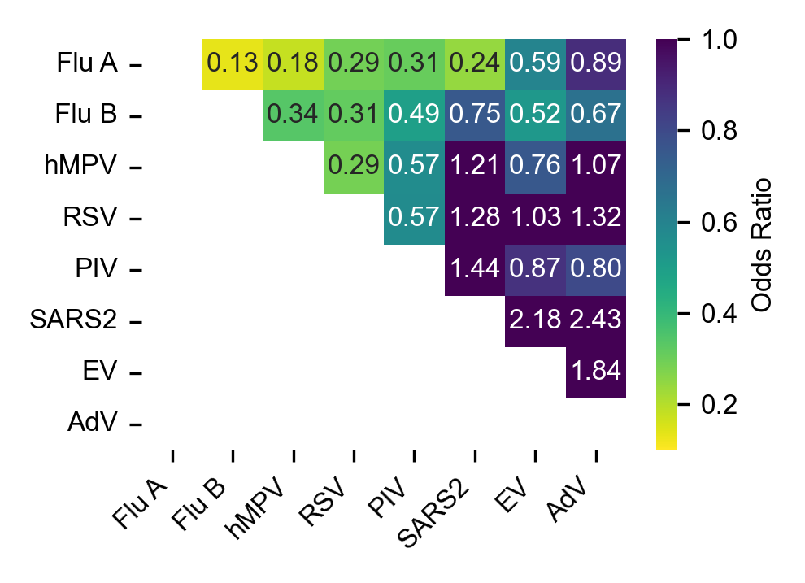
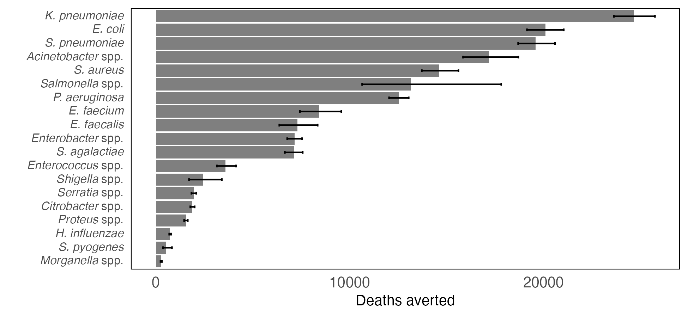
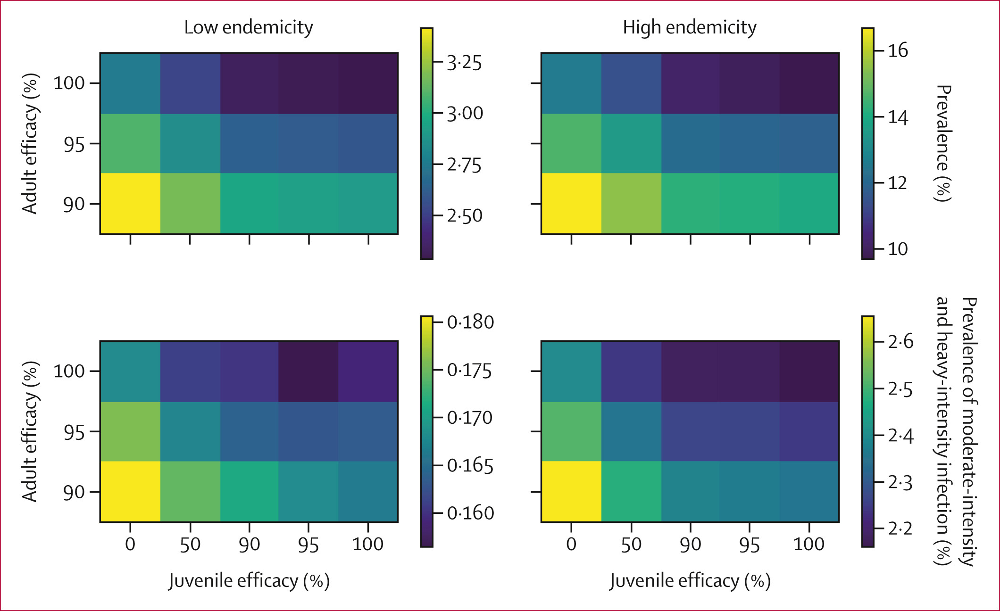

I'm Ben, a postdoctoral researcher in [Joe Lewnard's research group](https://joelewnard.github.io/joelewnard/) in the School of Public Health at the University of California, Berkeley. My interests are in mathematical and computational modelling of infectious diseases. I have a particular eye towards work with applications improving pandemic preparedness and global health equity. I'm currently attached to the [C-CORE](insightnet.us/centers/c-core/) centre of Insight Net, the CDC Center for Forecasting and Outbreak Analytics' project to improve outbreak response through collaboration between analytic experts and government.

## Current projects

- Understanding respiratory virus dynamics with data from pathogen re-emergence in Southern California

- Examining data on respiratory virus testing for signatures of viral interaction

- Characterizing the relationship between antibiotic consumption and resistance

- Supporting a range of student projects in the Lewnard group

## Publications

**Singer BJ**, Gomes M, Coulibaly JT, Daigavane M, Tan ST, Bogoch II, Lo NC. Population level impact of mass drug administration against schistosomiasis with novel anthelmintic drugs targeting juvenile schistosomes: a modelling study. The Lancet Microbe, 6, 101065 (2025). [https://doi.org/10.1016/j.lanmic.2024.101065](https://doi.org/10.1016/j.lanmic.2024.101065)

**Singer BJ**, Di Nardo A, Hein J, Ferretti L. Comparing Phylogeographies to Reveal Incompatible Geographical Histories within Genomes. Molecular Biology and Evolution, 41, msae126 (2024). [https://doi.org/10.1093/molbev/msae126](https://doi.org/10.1093/molbev/msae126)

**Singer BJ**, Coulibaly JT, Park HJ, Bogoch II, Lo NC. Development of prediction models to identify hotspots of schistosomiasis in endemic regions to guide mass drug administration. PNAS, 121, e2315463120 (2024). [https://doi.org/10.1073/pnas.2315463120](https://doi.org/10.1073/pnas.2315463120)
![Figure 1 from Singer BJ et al. PNAS 2024][assets/img/pnas.2315463120fig01.jpg]]

Tan ST, Kwan AT, Rodríguez-Barraquer I, **Singer BJ**, Park HJ, Lewnard JA, Sears D, Lo NC. Infectiousness of SARS-CoV-2 breakthrough infections and reinfections during the Omicron wave. Nature Medicine, 29, 358–365 (2023). [https://doi.org/10.1038/s41591-022-02138-x](https://doi.org/10.1038/s41591-022-02138-x)

**Singer BJ**, Thompson RN, Bonsall MB. Evaluating strategies for spatial allocation of vaccines based on risk and centrality. J. R. Soc. Interface, 19, 20210709 (2022). [https://doi.org/10.1098/rsif.2021.0709](https://doi.org/10.1098/rsif.2021.0709)

**Singer BJ**, Thompson RN, Bonsall MB. The effect of the definition of ‘pandemic’ on quantitative assessments of infectious disease outbreak risk. Scientific Reports, 11, 2547 (2021). [https://doi.org/10.1038/s41598-021-81814-3](https://doi.org/10.1038/s41598-021-81814-3)

Ferretti L, Di Nardo A, **Singer BJ**, Lasecka-Dykes L, Logan G, Wright CF, Pérez-Martín E, King DP, Tuthill TJ, Ribeca P. Within-Host Recombination in the Foot-and-Mouth Disease Virus Genome. Viruses, 10, 221 (2018). [https://doi.org/10.3390/v10050221](https://doi.org/10.3390/v10050221)
